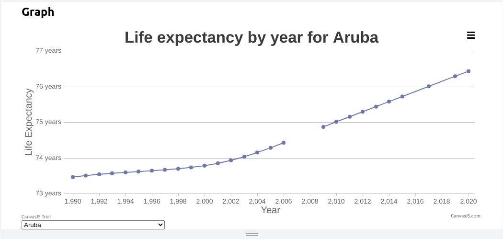

# Bigdata

## Screenshot 

> An application that can take in uploaded data from a file and save it into the database. There is search and filter functionality from the front end and a graphical representation of the data uploaded.

## Built With

- React
- Nodejs
- MongoDB, mongoose

## Getting Started

### Setup

1. git clone https://github.com/mnekx/bigdata.git
2. cd bigdata/client
3. npm install
4. npm start to serve into local 3000 port
5. Open mongodb account, create a collection and get credentials
6. cd ../
7. create .env file with following format 
    mongodb+srv://mongodb:<password>@cluster0.xi0gd.mongodb.net/?retryWrites=true&w=majority
   refer to mongodb docs for the one suited to you.
8. cd server/
9. npm install 
10. npm start
11. access the app on http://localhost:3000/

### Deployment

https://crypto-tickers.herokuapp.com/

## Authors

👤 **Mnemba Chambuya**

- GitHub: [@mnekx](https://github.com/mnekx)
- Twitter: [@MnembaChambuya](https://twitter.com/MnembaChambuya)
- LinkedIn: [mnemba-chambuya](https://linkedin.com/in/mnemba-chambuya)

## 🤝 Contributing

Contributions, issues, and feature requests are welcome!

Feel free to check the [issues page](../../issues/).

## Show your support

Give a ⭐️ if you like this project!

## 📝 License

This project is [MIT](./MIT.md) licensed.

## Aknowledgements

Thanks to Nelson Sakwa, author of the original [design](https://www.behance.net/gallery/31579789/Ballhead-App-(Free-PSDs)).
